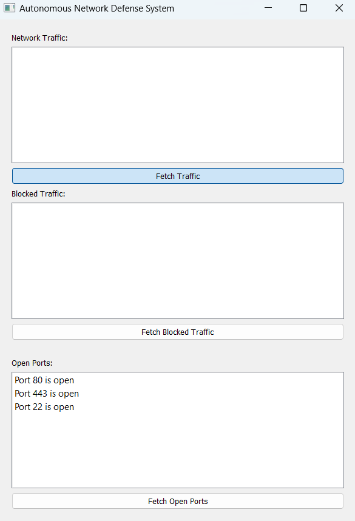
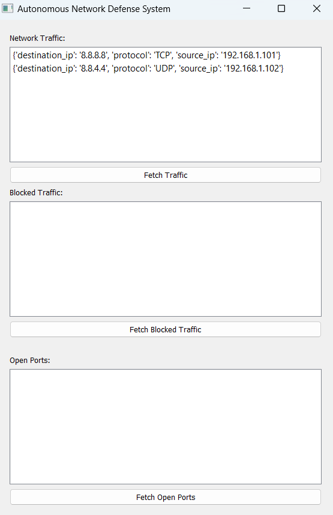

# Autonomous Network Defense System

This project consists of a simple autonomous network defense system that captures network traffic, detects anomalies, blocks suspicious traffic, detects/prevents ARP spoofing, and displays open ports.

## Project Structure

```bash
autonomous-network-defense/
│
├── backend/
│   ├── app.py  # Flask server
│   ├── anomaly_detection.py  # Anomaly detection logic
│   ├── arp_spoofing.py  # ARP spoofing detection and prevention
│   ├── firewall.py  # Firewall control logic
│   └── requirements.txt  # Dependencies for backend
│
├── frontend/
│   ├── main.py  # PyQt GUI
│   ├── ui/
│   │   ├── traffic_widget.py  # UI component to display network traffic
│   │   └── port_widget.py     # UI component to display open ports
│   └── requirements.txt  # Dependencies for frontend
│
└── README.md  # Project documentation
```

## Instructions

1. **Install Backend Dependencies**:
   Navigate to the `backend` directory and install dependencies using:
   ```bash
   pip install -r requirements.txt
   ```
   Backend Setup:

Navigate to the backend/ directory.
Install dependencies: 
```bash
pip install -r requirements.txt
```
Run the Flask server:
```bash
 python app.py
 ```
Frontend Setup:

Navigate to the frontend/ directory.
Install PyQt5: 
```bash
pip install PyQt5
```
Run the frontend application: 
```bash
python main.py
```
Testing:

The frontend should now display the captured network traffic and blocked traffic in real-time.
You can manually test the backend routes by visiting:
http://localhost:5000/network/traffic
http://localhost:5000/network/blocked


